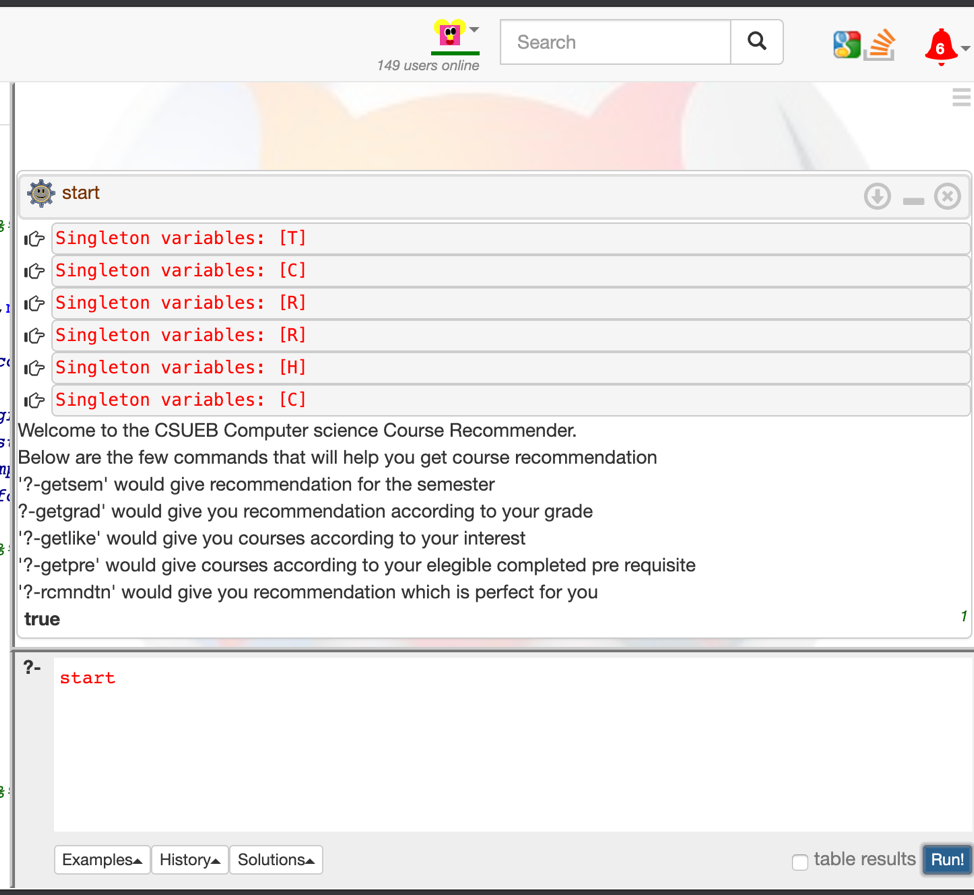

# Course Recommender System
A recommendation system that would provide list of computer science courses to a student based on his interest. This will help student to make right choice which best suites his/her.

1. Start is the first command through which student will get to know what are the other commands for the course recommendation.
  - Below is the screenshot.
  - 
  
  
2. To get course recommendation according to the semester, use “getsem” command. Give the answer in 1,2,3 and 4. In my database I have assigned semester to all courses.
  - Below is the screenshot.
  - 
  
  
3. Student can choose the subject according to their like and dislike. I have made some criteria, first one is theory or programming and student can choose according to their interest. Then I have distributed all courses to some type, student can choose generic area from the list. The command is “getlike”. 
  - Below is the screenshot.
  - 
  
  
4. Some are the function like getting the eligible course according to pre-requisite completed. Student can check are they eligible or not/ which courses they can take according to eligibility. Command is “getpre”
  - Below is the screenshot.
  - 
  
  
5. The course in which student has secured highest rank is the course best suits to him. I have taken user input in which he scored highest grad and eligible pre req subjects and then recommend him the courses. I have attached “qualities” some big generic to a subject. The course he scored highest would compare with other similar courses and recommend them.
The command is “rcmndtn”
  - Below is the screenshot.
  - 
